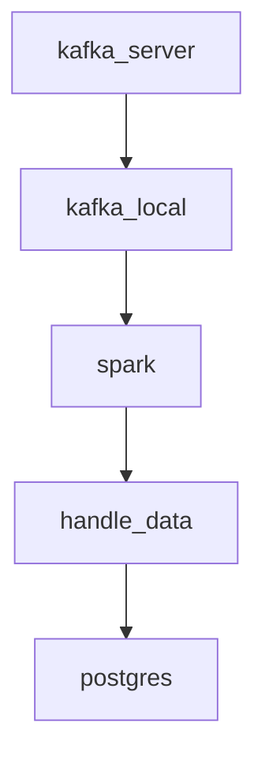

# unigap-spark
## Mục lục 
- [Tổng quan](#tổng-quan)
- [Công nghệ sử dụng](#công-nghệ-sử-dụng)
- [Luồng dữ liệu](#luồng-dữ-liệu)
- [Cấu trúc dự án](#cấu-trúc-dự-án)
- [Cách sử dụng](#cách-sử-dụng)
## Tổng quan
Dự án này Bài toán kết hợp việc sử dụng `kafka` và `spark`. Sử dụng `spark` đọc dữ liệu từ `kafka` sau đó xử lý, tính toán và lưu trữ vào db postgres

## Công nghệ sử dụng
+ Docker
+ Apache Kafka
+ Apache Spark
+ PostgreSQL
+ Python
+ Adminer (công cụ quản lý cơ sở dữ liệu dựa trên web)

## Luồng dữ liệu


## Cấu trúc dự án
<pre>
<code>
spark/
│
├── <span style="color: #4CAF50;">99-project</span>   # Thư mục chứa dự án chính hoặc các bài tập tổng hợp.
├── <span style="color: #4CAF50;">docker-compose.yml</span>   # Tệp cấu hình Docker để triển khai ứng dụng trong môi trường container.
├── <span style="color: #4CAF50;">requirements.txt</span>   # Liệt kê các thư viện Python cần thiết cho dự án.

</code>
</pre>

## Cách sử dụng
  _### Cách chạy với kafka_
  **[Link Kafka](https://github.com/pKietDE/kafka-postgres)**
  > [!NOTE]
  > 1. Cài đặt biến môi trường đầy đủ cho file kafka_config.conf
  > 2. Chạy dockerfile và docker-compose.yml trong repo này
  > 3. Cài đặt lại IP External trong Advance Listener nếu sử dụng <span style="color:red">`địa chỉ máy khác`</span>
  > 4. Chạy file main.py trong repo kafka để tiến hành xử lý.
   
  


  ### Cách chạy với spark-submit
  _**Cách chạy chương trình sử dụng thư viện ngoài thông qua virtual env**_
  ```
  docker container stop test-streaming || true &&
  docker container rm test-streaming || true &&
  docker run -ti --name test-streaming \
  --network=streaming-network \
  -p 4040:4040 \
  -v ./:/spark \
  -v spark_lib:/opt/bitnami/spark/.ivy2 \
  -v spark_data:/data \
  -e PYSPARK_DRIVER_PYTHON='python' \
  -e PYSPARK_PYTHON='./environment/bin/python' \
  -e KAFKA_BOOTSTRAP_SERVERS='34.29.192.39:9094,34.29.192.39:9194,34.29.192.39:9294' \
  -e KAFKA_SASL_JAAS_CONFIG='org.apache.kafka.common.security.plain.PlainLoginModule required username="kafka" password="UnigapKafka@2024";' \
  unigap/spark:3.5 bash -c "python -m venv pyspark_venv &&
  source pyspark_venv/bin/activate &&
  pip install --upgrade pip &&
  pip install -r /spark/requirements.txt &&
  venv-pack -o pyspark_venv.tar.gz &&
  spark-submit \
  --packages org.apache.spark:spark-sql-kafka-0-10_2.12:3.5.1,org.postgresql:postgresql:42.7.3 \
  --archives pyspark_venv.tar.gz \
  --py-files /spark/99-project/util.zip \
  /spark/99-project/test.py"
  ```
  > [!WARNING]
  > Hãy đứng đúng vị trí của folder khi chạy để không mắc lỗi  `not found file.py` hoặc `not found folder`
  

